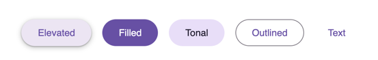
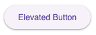
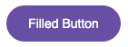
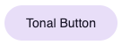
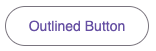
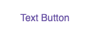
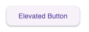

# Button

Button is an input for action. There are five kinds of buttons in Material Design: elevated, filled, filled tonal,
outlined, and text.

## Types



```tsx
<ElevatedButton label="Elevated"/>
<FilledButton label="Filled"/>
<FilledTonalButton label="Tonal"/>
<OutlinedButton label="Outlined"/>
<TextButton label="Text"/>
```

From left to right, they are:

1. Elevated Button
2. Filled Button
3. Filled Tonal Button
4. Outlined Button
5. Text Button

## Common Properties

| Property     | Type        | Description                             | Default |
|--------------|-------------|:----------------------------------------|---------|
| label        | `string`    | -                                       | -       |
| icon         | `ReactNode` | -                                       | -       |
| trailingIcon | `boolean`   | Whether render the icon at the line end | `false` |
| showIcon     | `boolean`   | Whether to render the icon or not       | `true`  |
| disabled     | `boolean`   | -                                       | `false` |

Any other `<button>` properties are supported by default.

## Elevated Button

The Elevated button visually appears to be raised, creating a noticeable contrast with its surroundings.



```tsx
<ElevatedButton label="Elevated Button"/>
```

## Filled Button

The Filled button is the most common type of button, typically used for confirming messages, submitting data, or other
important actions.



```tsx
<FilledButton label="Filled Button"/>
```

## Filled Tonal Button

The Filled Tonal button has a tone that falls between the Filled Button and the Outlined Button. It is often used in
scenarios with lower priority than the Filled Button, such as “Cancel” or “Next” within a dialog.



```tsx
<FilledTonalButton label="Tonal Button"/>
```

## Outlined Button

The Outlined button has a subdued tone, appearing almost transparent, which makes its emphasis relatively modest. It is
commonly used in general task scenarios.



```tsx
<OutlinedButton label="Outlined Button"/>
```

## Text Button

The Text button is fully transparent except for its text and is typically used for the lowest-priority actions,
especially those that are optional among multiple choices.



```tsx
<TextButton label="Text Button"/>
```

## Theming

All buttons supports customizing colors, shape and typography.

You can achieve a custom appearance simply by defining the token value in the parent element of the component.



```css
:root {
    --md-cust-elevated-button-container-shape: 10px;
    --md-cust-elevated-button-label-text-font: system-ui;
}
```

### Elevated Button Tokens

| Token                                                       | Description |
|-------------------------------------------------------------|-------------|
| --md-cust-elevated-button-container-color                   | -           |
| --md-cust-elevated-button-container-elevation               | -           |
| --md-cust-elevated-button-container-height                  | -           |
| --md-cust-elevated-button-container-shadow-color            | -           |
| --md-cust-elevated-button-container-shape                   | -           |
| --md-cust-elevated-button-disabled-container-color          | -           |
| --md-cust-elevated-button-disabled-container-elevation      | -           |
| --md-cust-elevated-button-disabled-container-opacity        | -           |
| --md-cust-elevated-button-disabled-icon-color               | -           |
| --md-cust-elevated-button-disabled-icon-opacity             | -           |
| --md-cust-elevated-button-disabled-label-text-color         | -           |
| --md-cust-elevated-button-disabled-label-text-opacity       | -           |
| --md-cust-elevated-button-focus-container-elevation         | -           |
| --md-cust-elevated-button-focus-icon-color                  | -           |
| --md-cust-elevated-button-focus-label-text-color            | -           |
| --md-cust-elevated-button-hover-container-elevation         | -           |
| --md-cust-elevated-button-hover-icon-color                  | -           |
| --md-cust-elevated-button-hover-label-text-color            | -           |
| --md-cust-elevated-button-hover-state-layer-color           | -           |
| --md-cust-elevated-button-hover-state-layer-opacity         | -           |
| --md-cust-elevated-button-icon-color                        | -           |
| --md-cust-elevated-button-icon-size                         | -           |
| --md-cust-elevated-button-label-text-color                  | -           |
| --md-cust-elevated-button-label-text-font                   | -           |
| --md-cust-elevated-button-label-text-line-height            | -           |
| --md-cust-elevated-button-label-text-size                   | -           |
| --md-cust-elevated-button-label-text-weight                 | -           |
| --md-cust-elevated-button-leading-space                     | -           |
| --md-cust-elevated-button-pressed-container-elevation       | -           |
| --md-cust-elevated-button-pressed-icon-color                | -           |
| --md-cust-elevated-button-pressed-label-text-color          | -           |
| --md-cust-elevated-button-pressed-state-layer-color         | -           |
| --md-cust-elevated-button-pressed-state-layer-opacity       | -           |
| --md-cust-elevated-button-trailing-space                    | -           |
| --md-cust-elevated-button-with-leading-icon-leading-space   | -           |
| --md-cust-elevated-button-with-leading-icon-trailing-space  | -           |
| --md-cust-elevated-button-with-trailing-icon-leading-space  | -           |
| --md-cust-elevated-button-with-trailing-icon-trailing-space | -           |

### Filled Button Tokens

| Token                                                     | Description |
|-----------------------------------------------------------|-------------|
| --md-cust-filled-button-container-color                   | -           |
| --md-cust-filled-button-container-elevation               | -           |
| --md-cust-filled-button-container-height                  | -           |
| --md-cust-filled-button-container-shadow-color            | -           |
| --md-cust-filled-button-container-shape                   | -           |
| --md-cust-filled-button-disabled-container-color          | -           |
| --md-cust-filled-button-disabled-container-elevation      | -           |
| --md-cust-filled-button-disabled-container-opacity        | -           |
| --md-cust-filled-button-disabled-icon-color               | -           |
| --md-cust-filled-button-disabled-icon-opacity             | -           |
| --md-cust-filled-button-disabled-label-text-color         | -           |
| --md-cust-filled-button-disabled-label-text-opacity       | -           |
| --md-cust-filled-button-focus-container-elevation         | -           |
| --md-cust-filled-button-focus-icon-color                  | -           |
| --md-cust-filled-button-focus-label-text-color            | -           |
| --md-cust-filled-button-hover-container-elevation         | -           |
| --md-cust-filled-button-hover-icon-color                  | -           |
| --md-cust-filled-button-hover-label-text-color            | -           |
| --md-cust-filled-button-hover-state-layer-color           | -           |
| --md-cust-filled-button-hover-state-layer-opacity         | -           |
| --md-cust-filled-button-icon-color                        | -           |
| --md-cust-filled-button-icon-size                         | -           |
| --md-cust-filled-button-label-text-color                  | -           |
| --md-cust-filled-button-label-text-font                   | -           |
| --md-cust-filled-button-label-text-line-height            | -           |
| --md-cust-filled-button-label-text-size                   | -           |
| --md-cust-filled-button-label-text-weight                 | -           |
| --md-cust-filled-button-leading-space                     | -           |
| --md-cust-filled-button-pressed-container-elevation       | -           |
| --md-cust-filled-button-pressed-icon-color                | -           |
| --md-cust-filled-button-pressed-label-text-color          | -           |
| --md-cust-filled-button-pressed-state-layer-color         | -           |
| --md-cust-filled-button-pressed-state-layer-opacity       | -           |
| --md-cust-filled-button-trailing-space                    | -           |
| --md-cust-filled-button-with-leading-icon-leading-space   | -           |
| --md-cust-filled-button-with-leading-icon-trailing-space  | -           |
| --md-cust-filled-button-with-trailing-icon-leading-space  | -           |
| --md-cust-filled-button-with-trailing-icon-trailing-space | -           |

### Filled Tonal Button Tokens

| Token                                                           | Description |
|-----------------------------------------------------------------|-------------|
| --md-cust-filled-tonal-button-container-color                   |             |
| --md-cust-filled-tonal-button-container-elevation               |             |
| --md-cust-filled-tonal-button-container-height                  |             |
| --md-cust-filled-tonal-button-container-shadow-color            |             |
| --md-cust-filled-tonal-button-container-shape                   |             |
| --md-cust-filled-tonal-button-disabled-container-color          |             |
| --md-cust-filled-tonal-button-disabled-container-elevation      |             |
| --md-cust-filled-tonal-button-disabled-container-opacity        |             |
| --md-cust-filled-tonal-button-disabled-icon-color               |             |
| --md-cust-filled-tonal-button-disabled-icon-opacity             |             |
| --md-cust-filled-tonal-button-disabled-label-text-color         |             |
| --md-cust-filled-tonal-button-disabled-label-text-opacity       |             |
| --md-cust-filled-tonal-button-focus-container-elevation         |             |
| --md-cust-filled-tonal-button-focus-icon-color                  |             |
| --md-cust-filled-tonal-button-focus-label-text-color            |             |
| --md-cust-filled-tonal-button-hover-container-elevation         |             |
| --md-cust-filled-tonal-button-hover-icon-color                  |             |
| --md-cust-filled-tonal-button-hover-label-text-color            |             |
| --md-cust-filled-tonal-button-hover-state-layer-color           |             |
| --md-cust-filled-tonal-button-hover-state-layer-opacity         |             |
| --md-cust-filled-tonal-button-icon-color                        |             |
| --md-cust-filled-tonal-button-icon-size                         |             |
| --md-cust-filled-tonal-button-label-text-color                  |             |
| --md-cust-filled-tonal-button-label-text-font                   |             |
| --md-cust-filled-tonal-button-label-text-line-height            |             |
| --md-cust-filled-tonal-button-label-text-size                   |             |
| --md-cust-filled-tonal-button-label-text-weight                 |             |
| --md-cust-filled-tonal-button-leading-space                     |             |
| --md-cust-filled-tonal-button-pressed-container-elevation       |             |
| --md-cust-filled-tonal-button-pressed-icon-color                |             |
| --md-cust-filled-tonal-button-pressed-label-text-color          |             |
| --md-cust-filled-tonal-button-pressed-state-layer-color         |             |
| --md-cust-filled-tonal-button-pressed-state-layer-opacity       |             |
| --md-cust-filled-tonal-button-trailing-space                    |             |
| --md-cust-filled-tonal-button-with-leading-icon-leading-space   |             |
| --md-cust-filled-tonal-button-with-leading-icon-trailing-space  |             |
| --md-cust-filled-tonal-button-with-trailing-icon-leading-space  |             |
| --md-cust-filled-tonal-button-with-trailing-icon-trailing-space |             |

### Outlined Button Tokens

| Token                                                  | Default | Description |
|--------------------------------------------------------|---------|-------------|
| --md-outlined-button-container-height                  |         |             |
| --md-outlined-button-container-shape                   |         |             |
| --md-outlined-button-disabled-icon-color               |         |             |
| --md-outlined-button-disabled-icon-opacity             |         |             |
| --md-outlined-button-disabled-label-text-color         |         |             |
| --md-outlined-button-disabled-label-text-opacity       |         |             |
| --md-outlined-button-disabled-outline-color            |         |             |
| --md-outlined-button-disabled-outline-opacity          |         |             |
| --md-outlined-button-focus-icon-color                  |         |             |
| --md-outlined-button-focus-label-text-color            |         |             |
| --md-outlined-button-hover-icon-color                  |         |             |
| --md-outlined-button-hover-label-text-color            |         |             |
| --md-outlined-button-hover-state-layer-color           |         |             |
| --md-outlined-button-hover-state-layer-opacity         |         |             |
| --md-outlined-button-icon-color                        |         |             |
| --md-outlined-button-icon-size                         |         |             |
| --md-outlined-button-label-text-color                  |         |             |
| --md-outlined-button-label-text-font                   |         |             |
| --md-outlined-button-label-text-line-height            |         |             |
| --md-outlined-button-label-text-size                   |         |             |
| --md-outlined-button-label-text-weight                 |         |             |
| --md-outlined-button-leading-space                     |         |             |
| --md-outlined-button-outline-color                     |         |             |
| --md-outlined-button-outline-width                     |         |             |
| --md-outlined-button-pressed-icon-color                |         |             |
| --md-outlined-button-pressed-label-text-color          |         |             |
| --md-outlined-button-pressed-outline-color             |         |             |
| --md-outlined-button-pressed-state-layer-color         |         |             |
| --md-outlined-button-pressed-state-layer-opacity       |         |             |
| --md-outlined-button-trailing-space                    |         |             |
| --md-outlined-button-with-leading-icon-leading-space   |         |             |
| --md-outlined-button-with-leading-icon-trailing-space  |         |             |
| --md-outlined-button-with-trailing-icon-leading-space  |         |             |
| --md-outlined-button-with-trailing-icon-trailing-space |         |             |

### Text Button Tokens

| Token                                                   | Description |
|---------------------------------------------------------|-------------|
| --md-cust-text-button-container-height                  |             |
| --md-cust-text-button-container-shape                   |             |
| --md-cust-text-button-disabled-icon-color               |             |
| --md-cust-text-button-disabled-icon-opacity             |             |
| --md-cust-text-button-disabled-label-text-color         |             |
| --md-cust-text-button-disabled-label-text-opacity       |             |
| --md-cust-text-button-focus-icon-color                  |             |
| --md-cust-text-button-focus-label-text-color            |             |
| --md-cust-text-button-hover-icon-color                  |             |
| --md-cust-text-button-hover-label-text-color            |             |
| --md-cust-text-button-hover-state-layer-color           |             |
| --md-cust-text-button-hover-state-layer-opacity         |             |
| --md-cust-text-button-icon-color                        |             |
| --md-cust-text-button-icon-size                         |             |
| --md-cust-text-button-label-text-color                  |             |
| --md-cust-text-button-label-text-font                   |             |
| --md-cust-text-button-label-text-line-height            |             |
| --md-cust-text-button-label-text-size                   |             |
| --md-cust-text-button-label-text-weight                 |             |
| --md-cust-text-button-leading-space                     |             |
| --md-cust-text-button-pressed-icon-color                |             |
| --md-cust-text-button-pressed-label-text-color          |             |
| --md-cust-text-button-pressed-state-layer-color         |             |
| --md-cust-text-button-pressed-state-layer-opacity       |             |
| --md-cust-text-button-trailing-space                    |             |
| --md-cust-text-button-with-leading-icon-leading-space   |             |
| --md-cust-text-button-with-leading-icon-trailing-space  |             |
| --md-cust-text-button-with-trailing-icon-leading-space  |             |
| --md-cust-text-button-with-trailing-icon-trailing-space |             |