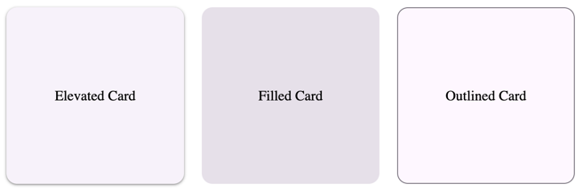

# Card

A Card is a simple container used to contain related elements. In Material Design, there are three types: Elevated, Filled, and Outlined.



```tsx
{
  render: () => {
    return (
      <div style={{display: 'flex', gap: "20px"}}>
        <ElevatedCard style={{
          width: "200px",
          height: "200px",
          display: "flex",
          justifyContent: "center",
          alignItems: "center"
        }}>
          Elevated Card
        </ElevatedCard>

        <FilledCard style={{
          width: "200px",
          height: "200px",
          display: "flex",
          justifyContent: "center",
          alignItems: "center"
        }}>
          Filled Card
        </FilledCard>

        <OutlinedCard style={{
          width: "200px",
          height: "200px",
          display: "flex",
          justifyContent: "center",
          alignItems: "center"
        }}>
          Outlined Card
        </OutlinedCard>
      </div>
    );
  }
}
```

## Theming
All cards supports customizing colors, shape and typography.

You can achieve a custom appearance simply by defining the token value in the parent element of the component.

### Elevated Card
| Token                                           | Description |
|-------------------------------------------------|-------------|
| --md-elevated-card-container-color              |             |
| --md-elevated-card-container-elevation          |             |
| --md-elevated-card-container-shadow-color       |             |
| --md-elevated-card-container-shape              |             |
| --md-elevated-card-disabled-container-color     |             |
| --md-elevated-card-disabled-container-elevation |             |
| --md-elevated-card-disabled-container-opacity   |             |
| --md-elevated-card-dragged-container-elevation  |             |
| --md-elevated-card-dragged-state-layer-color    |             |
| --md-elevated-card-dragged-state-layer-opacity  |             |
| --md-elevated-card-focus-container-elevation    |             |
| --md-elevated-card-focus-state-layer-color      |             |
| --md-elevated-card-focus-state-layer-opacity    |             |
| --md-elevated-card-hover-container-elevation    |             |
| --md-elevated-card-hover-state-layer-color      |             |
| --md-elevated-card-hover-state-layer-opacity    |             |
| --md-elevated-card-icon-color                   |             |
| --md-elevated-card-icon-size                    |             |
| --md-elevated-card-pressed-container-elevation  |             |
| --md-elevated-card-pressed-state-layer-color    |             |
| --md-elevated-card-pressed-state-layer-opacity  |             |

## Filled Card
| Token                                             | Description |
|---------------------------------------------------|-------------|
| --md-filled-card-container-color                  |             |
| --md-filled-card-container-elevation              |             |
| --md-filled-card-container-shadow-color           |             |
| --md-filled-card-container-shape                  |             |
| --md-filled-card-disabled-container-color         |             |
| --md-filled-card-disabled-container-elevation     |             |
| --md-filled-card-disabled-container-opacity       |             |
| --md-filled-card-dragged-container-elevation      |             |
| --md-filled-card-dragged-state-layer-color        |             |
| --md-filled-card-dragged-state-layer-opacity      |             |
| --md-filled-card-focus-container-elevation        |             |
| --md-filled-card-focus-state-layer-color          |             |
| --md-filled-card-focus-state-layer-opacity        |             |
| --md-filled-card-hover-container-elevation        |             |
| --md-filled-card-hover-state-layer-color          |             |
| --md-filled-card-hover-state-layer-opacity        |             |
| --md-filled-card-icon-color                       |             |
| --md-filled-card-icon-size                        |             |
| --md-filled-card-pressed-container-elevation      |             |
| --md-filled-card-pressed-state-layer-color        |             |
| --md-filled-card-pressed-state-layer-opacity      |             |

## Outlined Tokens
| Token                                             | Description |
|---------------------------------------------------|-------------|
| --md-outlined-card-container-color                |             |
| --md-outlined-card-container-elevation            |             |
| --md-outlined-card-container-shadow-color         |             |
| --md-outlined-card-container-shape                |             |
| --md-outlined-card-outline-color                  |             |
| --md-outlined-card-outline-width                  |             |